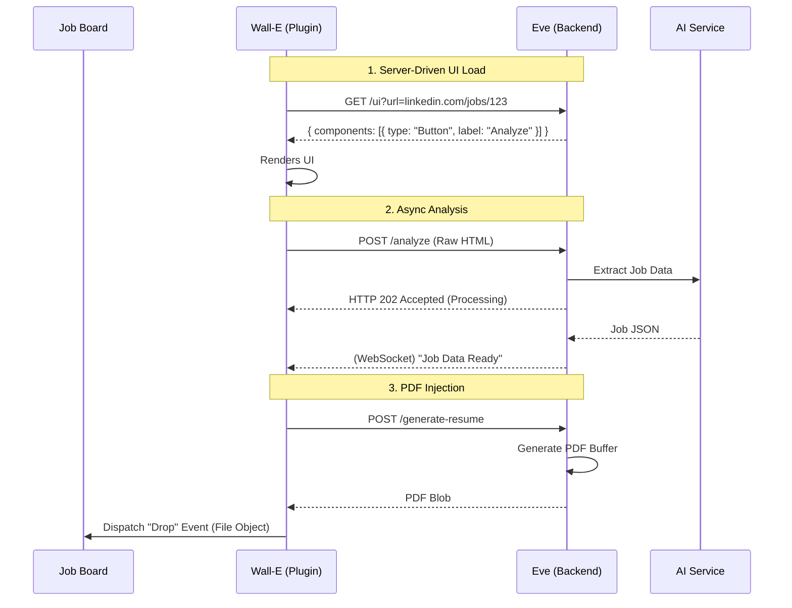

# Technical Specification: Eve & Wall-E (Brainstorm V2)

## 1. Architectural Philosophy: "Light Plugin, Heavy Backend"

The V2 architecture shifts complexity away from the client (Wall-E Chrome Extension) to the server (Eve). This approach minimizes extension store update cycles, centralizes logic for rapid iteration, and leverages server-side power for complex tasks like AI processing and PDF generation.

### Core Tenets
1.  **Server-Driven UI**: The extension is a dumb renderer; the server dictates the interface.
2.  **Semantic Intelligence**: Actions are defined by intent ("Apply Button"), not rigid selectors.
3.  **Resilience**: The system handles network instability and changes in target website DOM structures gracefully.

## 2. Key Architectural Components

### 2.1 Server-Driven UI (SDUI)
**Problem**: Hardcoding UI components in the extension requires a full store review for every visual change.
**Solution**:
-   **Protocol**: Wall-E queries Eve on load or navigation: `GET /ui?url={current_url}`.
-   **Response**: Eve returns a JSON schema describing the UI layout, component hierarchy, and data bindings (e.g., Buttons, Cards).
-   **Rendering**: Wall-E parses this JSON and dynamically renders native React components.
-   **Benefit**: New features (e.g., a "Drafts" tab) can be deployed instantly by updating the Eve backend.

### 2.2 Self-Healing Form Engine
**Problem**: CSS selectors break frequently as job boards update their DOM.
**Solution**: **Semantic Locators**.
-   **Mechanism**:
    1.  Eve stores semantic descriptors for targets (e.g., "The primary submit button", "The input field looking like a LinkedIn URL").
    2.  When Wall-E cannot find an element with cached selectors, it snapshots the relevant DOM segment.
    3.  **On-Demand LLM Call**: Eve analyzes the DOM snapshot to identify the correct element ID/Path.
    4.  **Feedback Loop**: The new selector is cached for future users.

### 2.3 Async Delegation & State Management
**Problem**: Large scraping tasks or heavy AI generation block the extension UI.
**Solution**: WebSocket/SSE Push.
-   **Flow**:
    1.  **Ingest**: Wall-E sends raw context (HTML, Screenshot, User Session) to Eve.
    2.  **Process**: Eve delegates tasks to background workers (Embeddings generation, Knowledge Graph updates, LLM inference).
    3.  **Push**: Updates are streamed back to Wall-E via `WebSocket` or `Server-Sent Events` (SSE).
    4.  **Result**: UI updates in real-time without polling.

### 2.4 Offline Queue Strategy
**Problem**: Users may operate on unstable connections; data loss is unacceptable.
**Solution**: Local-First with Sync.
-   **Storage**: Wall-E persists all actions (clicks, form fills, drafts) immediately to `chrome.storage.local`.
-   **Replay**: A background worker monitors connection health.
    -   *If Offline*: Actions accumulate in a prioritized queue.
    -   *On Reconnect*: The queue is flushed to Eve sequentially.
    -   *Conflict Resolution*: "Last-write-wins" or server-guided merge for complex conflicts.

### 2.5 PDF Dynamic Injection
**Problem**: Uploading a generated resume requires complex file handling usually blocked by browser sandboxes.
**Solution**: Buffer-to-Drop Event.
-   **Generation**: Eve generates the tailored PDF using a headless renderer (e.g., Puppeteer/Playwright) and returns a binary buffer or signed URL.
-   **Injection**:
    1.  Wall-E fetches the blob.
    2.  Wall-E constructs a standard JavaScript `File` object in the content script context.
    3.  Wall-E synthetically triggers a `drop` event on the target website's drop zone, bypassing the OS file picker dialog entirely.

## 3. Interaction Sequence

## 4. Technical Stack

-   **Wall-E (Client)**:
    -   Chrome Extension Manifest V3
    -   React (for rendering SDUI)
    -   `chrome.storage` (Offline queue)
-   **Eve (Server)**:
    -   Node.js / Python (FastAPI)
    -   WebSocket Server / SSE
    -   Puppeteer (PDF Generation)
    -   Vector DB (Knowledge Graph)
